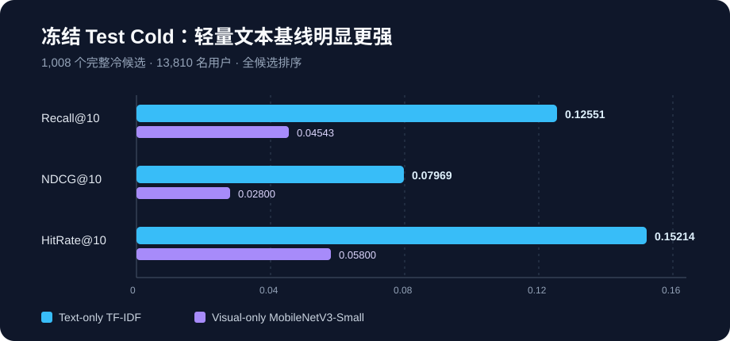

# ColdLens

> 面向 AI 产品经理求职的严格短视频 Item Cold-Start 推荐实验：用公开评论行为构建用户兴趣，在新候选视频无历史交互时，仅依赖标题与封面完成全候选排序。



**在线体验：** [ColdLens 冷启动推荐实验室](https://coldlens-yuxuan.reamurrayboz.chatgpt.site)（安全公开版；交互内容均为合成数据）

## 三分钟结论

ColdLens 不是一个“多模态一定更好”的演示项目，而是一次完整的产品—模型决策实验：先定义冷启动与成功门槛，再用 Validation 选择方案，最后只运行一次冻结 Test。

- 数据：MicroLens-50K，359,708 条公开评论交互、50,000 名用户、19,220 个视频。
- 任务：严格模型侧 Item Cold-Start；Test 中的 1,008 个候选视频在 `final_train` 中零交互。
- 评测：13,810 名合格用户、18,812 个正例，全量候选排序，不采样负例。
- 结果：Text-only 在所有冻结 K 和指标上均优于 Visual-only；Text Recall@10 为 **0.12551**，NDCG@10 为 **0.07969**。
- 决策：保留标题 TF-IDF 作为当前轻量主方案；三类多模态融合均未通过预先约定的 Validation 门槛，因此不进入 Test，也不事后改口径。
- 成本：全部模型实验在本地 CPU 完成；未使用公司服务器，也未为追求复杂模型扩大基础设施成本。

## 我解决的不是“怎么堆模型”

核心产品问题是：在缺少视频交互信号时，哪些内容信号值得优先投入，怎样证明新增模态的收益足以覆盖复杂度和成本？

我将问题拆成四个可审计决策：

1. **定义有效问题**：把“首次观察到评论”与“真实上传时间”区分开，只声称模型侧冷启动。
2. **冻结评测协议**：按时间构造开发训练、Validation Cold、最终训练和 Test Cold；Test 不参与调参。
3. **从低成本基线逐步加码**：先标题，再封面，再做全局融合、条件门控和学习式融合。
4. **以门槛做去留**：只有 Recall@10 与 NDCG@10 同时严格提升，融合才可进入最终候选。

## 冻结 Test 结果

| 模型 | Recall@10 | NDCG@10 | HitRate@10 | Recall@50 | NDCG@50 |
|---|---:|---:|---:|---:|---:|
| **Text-only TF-IDF** | **0.12551** | **0.07969** | **0.15214** | **0.23490** | **0.10572** |
| Visual-only MobileNetV3-Small | 0.04543 | 0.02800 | 0.05800 | 0.13652 | 0.04887 |

结果的业务含义不是“视觉无用”。Visual-only 明显高于随机量级，并与 Text 存在用户级互补；但现有轻量融合无法稳定识别该在何时使用视觉。继续上线融合会增加特征链路、监控和回退成本，却没有满足冻结的主指标门槛。

学习式融合在内部均匀负采样代理任务上更好，也让 Validation NDCG@10 从 0.08211 小幅升至 0.08283，但 Recall@10 从 0.12797 降至 0.12717。按事前规则，它仍被拒绝。这揭示了一个重要风险：**训练代理任务改善，不等于线上目标或外层排序指标同步改善**。

完整数字与敏感性分析见 [冻结最终测试结果](docs/FINAL_TEST_RESULTS.md)；模型进入 Test 前的约束见 [模型冻结记录](docs/MODEL_FREEZE_V1.md)。

## 产品判断

当前可落地的 MVP 是“标题兴趣匹配兜底”，而不是多模态融合系统。若进入真实平台验证，我会：

- 只覆盖无可靠行为特征的新内容，成熟内容继续走原推荐链路；
- 以用户或请求为随机化单位，对比现有冷启动策略与 Text-only 兜底；
- 主指标使用新内容的有效消费或高意图互动，护栏监控跳失、投诉/不感兴趣、延迟与内容覆盖；
- 先做 SRM、埋点与样本量检查，再解释效果；不把本项目离线 Recall 直接换算成 CTR 或留存。

这只是上线实验设计，不是已发生的线上 A/B 结果。更完整的产品故事与决策复盘见 [AI 产品经理案例](docs/PORTFOLIO_CASE_STUDY.md)。

## 可信度边界

- 交互来自公开评论，代表较高意图正反馈，不是曝光、点击、播放时长或留存。
- 第一次被观察到评论不等于视频上传时间，因此这是模型侧 Item Cold-Start，不是真实发布时刻冷启动。
- 离线指标只能验证匹配与排序能力，不能证明业务因果提升。
- 封面相同/近似可能造成泄漏；项目额外报告了排除跨边界 `dHash=0` 候选的敏感性结果，主结论不变。
- Validation 与 Test 的候选数和分布不同，不能把两者数值差直接解释为纯粹的泛化变化。

## 项目结构

```text
configs/                    冻结的数据切分与评测配置
docs/                       数据审计、实验协议、结果与产品案例
scripts/                    审计、特征提取、训练和评测入口
demo/                       本地只读推荐解释 Demo
data/ artifacts/ outputs/   本地数据与产物（被 Git 忽略）
```

建议阅读顺序：

1. [作品集案例](docs/PORTFOLIO_CASE_STUDY.md)
2. [3–5 分钟面试讲解路线](docs/INTERVIEW_WALKTHROUGH.md)
3. [简历项目描述](docs/RESUME_PROJECT_DESCRIPTION.md)
4. [数据与产品分析](docs/PRODUCT_ANALYSIS.md)
5. [系统方案](docs/SYSTEM_DESIGN.md)
6. [数据审计](docs/M0_DATA_AUDIT.md)
7. [离线评测协议](docs/EVALUATION_PROTOCOL.md)
8. [融合实验结果](docs/LEARNED_FUSION_RESULTS.md)
9. [最终测试结果](docs/FINAL_TEST_RESULTS.md)
10. [公开 Demo 数据边界](docs/PUBLIC_DEMO_PROTOCOL.md)

## 本地 Demo

当前含真实标题与派生向量的完整版只在本地使用，不直接部署公网。公开安全版已经实现：它只展示冻结聚合指标，并用完全自写的合成示例解释机制。生产构建只复制 `demo/public-safe/`，不会复制本地 `demo/public/demo-data.json`。详见 [公开 Demo 数据边界](docs/PUBLIC_DEMO_PROTOCOL.md)。

Demo 有三个独立模式：

- **机制样例**：公开版使用 8 个完全自写的合成用户，展示历史、假设目标、Text-only Top-10 与匹配词；它们不是 MicroLens 样本或实验结果。本地完整版仍可查看原来的 8 个匿名 Validation 样例。
- **创建模拟用户**：公开版提供 12 类、96 个可点击兴趣词、48 条合成历史和 72 个合成候选；浏览器会实时重新排序并展示主要相关历史。没有未来行为标签，因此不显示真实命中率，也不写回实验结果。
- **方案对比**：用已冻结的 Test 汇总和 Validation 去留记录说明为什么当前选择 Text-only、为什么三类融合被拒绝，以及视觉方案增加的工程成本与结论边界。

```powershell
.\.venv\Scripts\python.exe scripts\export_demo_data.py
Set-Location demo
npm.cmd ci
npm.cmd run dev
```

浏览器打开 `http://localhost:3000/` 默认查看安全公开版；只有本人需要检查离线完整版时才打开 `http://localhost:3000/?local=1`。本地数据文件被 Git 忽略；公开构建不会复制它。页面不读取原始 CSV、封面、视觉特征或 Test。“主要相关历史”是文本相似度解释，不是因果归因。当前 tokenizer 只可靠识别英文/数字兴趣词，不具备中文语义理解。详细边界见 [Demo 协议](docs/DEMO_PROTOCOL.md)。

也可以从项目根目录一键启动：

```powershell
powershell -ExecutionPolicy Bypass -File scripts\start_demo.ps1
```

项目完成状态、验收范围与公开前剩余决策见 [项目最终验收](docs/PROJECT_ACCEPTANCE.md)。

## 复现

项目在 Windows、Python 3.12.10、本地 CPU 环境完成。数据与模型产物不进入 Git；请从 [MicroLens 官方仓库](https://github.com/westlake-repl/MicroLens) 和[官方数据门户](https://recsys.westlake.edu.cn/)阅读许可与获取数据，不要再分发原始媒体。

```powershell
python -m venv .venv
.\.venv\Scripts\python.exe -m pip install -r requirements.txt
.\.venv\Scripts\python.exe scripts\audit_microlens50k.py
.\.venv\Scripts\python.exe scripts\build_split_v1.py
```

完整目录约定、实验顺序与冻结 Test 注意事项见 [复现指南](docs/REPRODUCIBILITY.md)。

## 技术栈

Python · NumPy · PyTorch/Torchvision · TF-IDF · MobileNetV3-Small · 时间切分 · 全候选 Top-K 排序 · 可复现性校验

## 许可证

项目代码采用 [MIT License](LICENSE)。MicroLens 数据与媒体不包含在本许可证授权范围内，仍须遵守其原始数据条款。

数据集论文：[MicroLens: Microscopic Lens for Benchmarking E-commerce Recommendations](https://arxiv.org/abs/2309.15379)。
