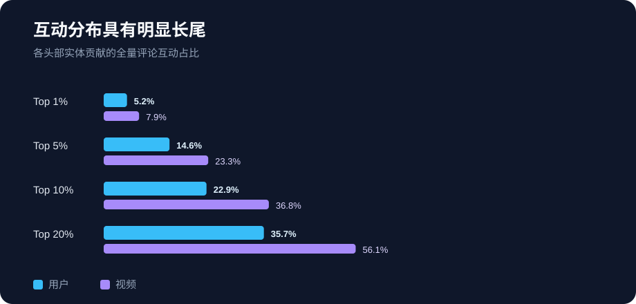
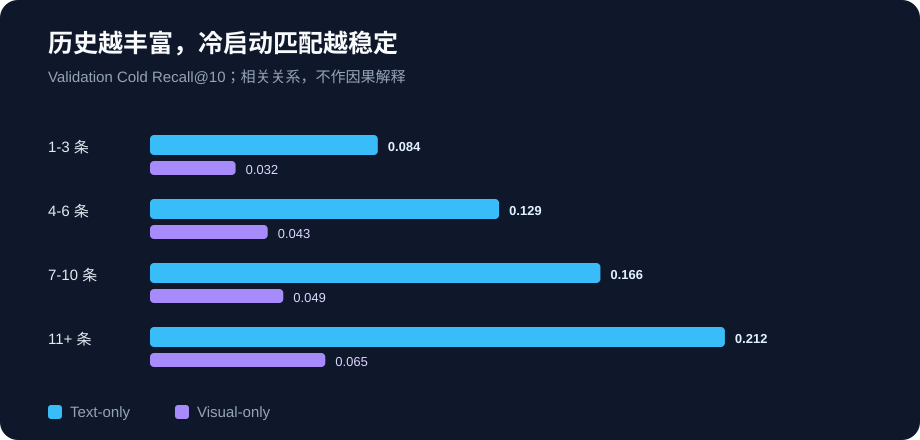

# ColdLens 数据与产品分析

> 分析版本：`product_analysis_v1`  
> 协议：[PRODUCT_ANALYSIS_PROTOCOL.md](PRODUCT_ANALYSIS_PROTOCOL.md)  
> 范围：全量描述统计 + Validation Cold 产品诊断；未读取 Test，未选择新模型

## 1. 核心结论

1. **视频侧长尾明显强于用户侧。** 视频互动 Gini 为 0.534，头部 20% 视频贡献 56.1% 评论互动；用户互动 Gini 为 0.216，头部 20% 用户贡献 35.7%。
2. **历史越丰富，Text 与 Visual 的匹配都越好。** Text Recall@10 从 1–3 条历史用户的 0.0841 增至 11+ 用户的 0.2123；这是相关关系，不是增加历史导致收益的因果证据。
3. **Visual 不只准确性较弱，曝光也更集中。** Visual Top-10 中头部 10% 候选占 67.7% 推荐槽位，Text 为 42.6%；Visual 曝光 Gini 为 0.798，Text 为 0.566。
4. **Text 的候选覆盖高，但不等于曝光均匀。** Text 至少向一名用户推荐了 1,299/1,305 个候选，覆盖率 99.5%，但头部 1% 候选仍占 10.1% 槽位。
5. **标题质量存在生产迁移风险。** 19,220 个标题中有 43 个在当前英文词法下成为空文本，少数标题长达数百甚至 1,232 个词，不能把当前结果简单外推为“真实平台短标题已足够”。



## 2. 数据生态：视频比用户更长尾

| 统计 | 用户互动数 | 视频互动数 |
|---|---:|---:|
| 实体数 | 50,000 | 19,220 |
| P25 | 5 | 5 |
| P50 | 6 | 11 |
| P75 | 8 | 25 |
| P90 | 11 | 44 |
| P95 | 13 | 59 |
| P99 | 24 | 99 |
| 最大值 | 218 | 342 |
| Gini | 0.216 | 0.534 |

| 头部实体 | 用户贡献互动 | 视频贡献互动 |
|---|---:|---:|
| Top 1% | 5.2% | 7.9% |
| Top 5% | 14.6% | 23.3% |
| Top 10% | 22.9% | 36.8% |
| Top 20% | 35.7% | 56.1% |

事实层面，视频互动分布更集中；用户分布相对平缓。用户最少有 5 条互动，很可能受到数据集抽样规则影响，因此不能把该分布当成真实平台全量用户生态。

产品层面的推测是：仅优化平均 Recall 可能掩盖内容曝光向少数视频聚集的问题。真实上线时需要同时监控新内容覆盖、创作者覆盖和曝光集中度，不能只看消费指标。

## 3. 标题信号质量

- 19,220 个视频均有原始标题字段；标准化后有 19,063 个不同标题。
- 43 个标题在小写英文数字分词后没有有效 token，主要是仍为中文的文本。
- token 数 P25/P50/P75 为 13/18/24，P95 为 36。
- 最大值为 1,232 个 token；抽查显示少数记录包含长篇剧情、人物简介或列表，而非通常意义上的短标题。

这同时带来两个方向相反的偏差：未翻译中文会让 Text 低估，异常长且信息丰富的文本又可能让 Text 高估。当前 Text-only 结果证明“该数据中的标题字段有匹配信号”，不能直接证明生产环境中的原始短标题具有同等效果。

## 4. 用户历史分层



| 训练历史 | 用户数 | 用户占比 | Text Recall@10 | Visual Recall@10 |
|---|---:|---:|---:|---:|
| 1–3 | 4,333 | 31.5% | 0.0841 | 0.0316 |
| 4–6 | 6,126 | 44.6% | 0.1289 | 0.0434 |
| 7–10 | 2,025 | 14.7% | 0.1663 | 0.0492 |
| 11+ | 1,266 | 9.2% | 0.2123 | 0.0647 |

11+ 历史用户的 Text Recall@10 约为 1–3 历史用户的 2.52 倍。Visual 也随历史长度上升，但所有分层都明显弱于 Text。

不能据此断言“让用户多互动就会使模型提升”：历史长度可能同时代理用户活跃度、兴趣稳定性、历史覆盖和评测正例数量。真正的因果判断需要实验或更细的控制分析。

## 5. 推荐曝光诊断

以下统计只描述 Validation Cold 的 Top-10 推荐槽位，不是真实线上曝光：

| 指标 | Text-only | Visual-only |
|---|---:|---:|
| Catalog Coverage@10 | 99.5% | 91.0% |
| Top 1% 候选曝光占比 | 10.1% | 19.3% |
| Top 10% 候选曝光占比 | 42.6% | 67.7% |
| 曝光 Gini（含零曝光） | 0.566 | 0.798 |
| 单候选最大进入 Top-10 次数 | 1,349 | 3,159 |

Text 与 Visual 每名用户的 Top-10 平均只交集 0.332 个候选，说明两种模态给出的排序差异很大。但此前的融合实验已经证明，“差异大”或存在 oracle 互补空间，不等于已有方法可以稳定获得收益。

Visual 高集中度可能来自封面模板、视觉风格簇或通用 ImageNet 表征的偏好；当前分析不能区分这些机制。它是值得进一步抽样检查的假设，不是已经证实的原因。

## 6. 对 MVP 的产品建议

以下是基于离线证据的产品建议，不是数据直接证明的事实：

### 覆盖策略

- **4 条及以上有效历史**：可作为 Text-only 冷启动兜底的首批验证人群。
- **1–3 条历史**：仍有信号，但效果明显较弱；应降低置信度，并保留探索或其他兜底来源。
- **零历史用户**：当前用户画像方法无法处理，需要独立的新用户策略，不能沿用本项目结论。

不建议把 4 条设为永久硬阈值。它只是基于当前分层结果形成的线上实验起点，应结合覆盖规模、流量和实际价值标签重新验证。

### 曝光护栏

- 同时监控新内容 Catalog Coverage、创作者覆盖和曝光 Gini；
- 检查头部推荐候选是否来自重复模板、标题异常或内容质量问题；
- 对视觉分支设置曝光集中度告警，避免弱排序信号放大单一视觉风格；
- 将特征缺失、全零画像和异常长文本作为数据质量指标。

### 下一批最有价值的数据

1. 真实上传时间，用于定义发布后的冷启动窗口；
2. 曝光、有效消费、跳失和负反馈，用于替代“未评论即负例”的错误假设；
3. 原始语言标题、字幕与可靠内容类别，用于检查翻译和分词偏差；
4. 创作者 ID 与内容质量状态，用于分析创作者公平和安全护栏；
5. 特征生成时间与线上延迟，用于评估真实工程 ROI。

## 7. 未回答的问题

- 没有类别字段，无法严谨比较不同内容类别的冷启动效果。
- 没有曝光分母，无法计算 CTR 或判断未互动是否为负反馈。
- 没有真实上传时间，无法估计发布后 1 小时、1 天等业务冷启动阶段。
- 没有创作者字段，无法判断推荐覆盖是否集中于少数创作者。
- 当前只是离线 Validation 诊断，不能证明任何策略会改善线上用户价值。

## 8. 复现

```powershell
.\.venv\Scripts\python.exe scripts\analyze_product_metrics.py
```

机器可读输出：`outputs/analysis/product_analysis_v1.json`（Git 忽略）。脚本同时生成两张可公开 SVG 图表。完整运行只使用本地 CPU，未读取 Test。
