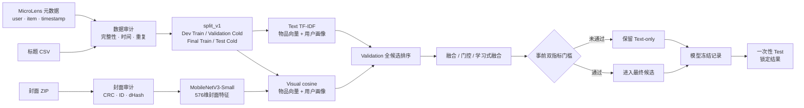
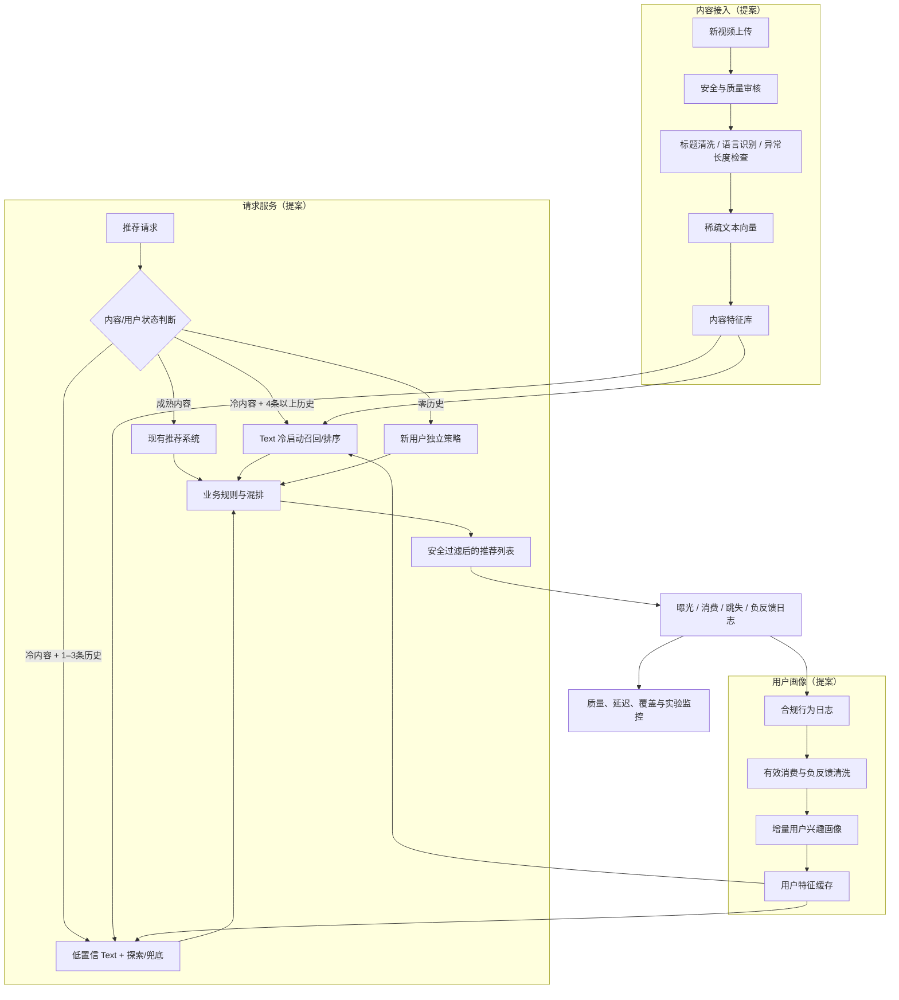

# ColdLens 系统方案

> 版本：v1，2026-08-14  
> 当前状态：离线实验系统已实现；线上服务架构、SLO 与 A/B 实验均为待验证提案

## 1. 先区分三种状态

| 标记 | 含义 |
|---|---|
| **已实现** | 本仓库已有代码、数据契约和可复现结果 |
| **提案** | 若接入真实推荐平台，建议采用的系统设计 |
| **未知** | 缺少生产流量、基础设施或标签，不能给出可信数字 |

当前项目已经证明：在 MicroLens-50K 的模型侧 Item Cold-Start 代理任务中，标题 TF-IDF 是可靠的轻量离线基线。项目没有部署在线 API、实时特征服务或生产推荐链路。

## 2. 已实现的离线系统

### 2.1 文件契约

| 阶段 | 主要输入 | 主要输出 | 状态 |
|---|---|---|---|
| 数据审计 | `MicroLens-50k_pairs.csv`、titles、covers ZIP | `outputs/m0/*.json` | 已实现 |
| 时间切分 | 原始交互、`configs/split_v1.json` | `data/processed/split_v1/*` | 已实现 |
| 文本特征 | Dev/Final Train、标题 | TF-IDF 词表、稀疏物品/用户向量（运行时构建） | 已实现 |
| 视觉特征 | 封面 ZIP、冻结预训练权重 | item IDs + `19220 × 576` float32 特征 | 已实现 |
| Validation | Dev Train、Validation Cold | 单模态与融合 JSON 报告 | 已实现 |
| 最终测试 | 冻结记录、Final Train、Test Cold | `frozen_final_test_v1.json` | 已实现并锁定 |
| 产品诊断 | 全量描述字段、Validation | 产品分析 JSON 与 SVG | 已实现 |

### 2.2 当前离线计算逻辑

Text-only：

1. 仅用训练窗口视频标题拟合 TF-IDF；
2. 每个历史视频标题得到 L2 归一化稀疏向量；
3. 用户画像为历史物品向量等权求和后归一化；
4. 用户画像与完整冷候选做余弦相似度；
5. 同分使用按用户固定随机种子的稳定顺序，避免 item ID 偏差。

Visual-only 使用相同的画像与余弦框架，但物品表示改为冻结 MobileNetV3-Small 的 576 维封面向量。Visual 目前只作为独立证据，不进入主方案。

## 3. 线上系统提案

这张图是目标架构，不是当前部署状态。其中“4 条以上”来自 Validation 分层形成的首轮实验假设，不应成为未经线上验证的永久硬阈值。

## 4. 推荐请求决策

| 条件 | 建议路径 | 原因 | 降级 |
|---|---|---|---|
| 内容已有可靠行为特征 | 现有成熟推荐系统 | ColdLens 不应替换成熟 ID/序列模型 | 原系统默认策略 |
| 冷内容，用户有 4+ 条有效历史 | Text 冷启动分支 | 当前证据最强的首批人群 | 画像过期时回到低置信路径 |
| 冷内容，用户有 1–3 条历史 | Text 降权 + 探索来源 | 有信号但 Validation 明显较弱 | 热门/编辑/随机探索组合 |
| 用户零历史 | 独立新用户策略 | 当前画像无法计算 | 上下文、地域、时间或合规热门 |
| 标题缺失、零向量或异常 | 不使用 Text 分 | 防止静默输出伪置信度 | 内容质量兜底或探索 |
| 特征服务超时/不可用 | 跳过 ColdLens | 可用性优先，避免阻塞主推荐 | 现有推荐系统 |

“热门”只代表生产系统中时间安全、合规计算的短窗口热度。本数据集的全局点赞/播放汇总不能直接实现该兜底，因为可能包含未来信息且没有曝光分母。

## 5. 在线计算与扩展方式

### 5.1 接入时预计算

- 新视频通过审核后立即清洗标题并生成稀疏向量；
- 记录特征版本、生成时间、语言、token 数、是否零向量；
- 特征失败不阻塞内容入库，但该内容进入降级路径并触发告警；
- 用户发生有效行为后增量更新画像，定期全量回算校验漂移。

### 5.2 请求时计算

离线实验对 1,008/1,305 个冷候选做完整排序。真实平台候选可能大得多，不能默认照搬全量扫描。推荐的演进路径是：

1. 小规模冷池：稀疏矩阵点积后取 Top-K；
2. 冷池增长：倒排索引或稀疏检索先召回，再由 Text 相似度排序；
3. 与成熟链路混排：使用可控配额，而不是让冷内容覆盖全部推荐位；
4. 只有线上证据证明收益后，才考虑视觉或语义模型增加特征链路。

## 6. 降级与故障处理

| 故障 | 检测信号 | 自动处理 | 后续动作 |
|---|---|---|---|
| 标题缺失/零向量 | `zero_vector_rate` | 跳过 Text 分，进入兜底 | 检查语言与分词覆盖 |
| 异常长文本 | token 数超过数据契约上限 | 截断或拒绝特征，保留原文审计 | 区分标题与正文来源 |
| 用户画像缺失/过期 | cache miss、profile age | 降到少历史/零历史路径 | 异步重建画像 |
| 特征版本不一致 | item/user version mismatch | 不混用，回到稳定版本 | 回填并核对发布流程 |
| 排序服务超时 | P95/P99、timeout rate | 熔断 ColdLens 分支 | 容量分析和回滚 |
| 曝光过度集中 | exposure Gini、Top-share 超阈值 | 降低冷分支配额或加探索约束 | 检查模板与质量偏差 |
| 实验样本比例失衡 | SRM 检验 | 暂停效果解读 | 修复分流或埋点 |

阈值不能从当前离线数据随意填写。生产阈值需要结合历史基线、容量测试和误报成本冻结。

## 7. 监控体系

### 7.1 数据质量

- 新内容标题缺失率、零向量率、语言分布、token 数 P50/P95/P99；
- 内容特征生成成功率、延迟和版本覆盖；
- 用户画像覆盖率、年龄分布、更新失败率；
- 训练/服务特征一致性和 schema 变更。

### 7.2 服务健康

- 请求量、成功率、超时率、P50/P95/P99 延迟；
- 候选池规模、召回数不足率、缓存命中率；
- CPU、内存、特征存储与网络开销；
- 熔断次数、降级路径占比和恢复时间。

### 7.3 模型与生态

- 冷内容有效消费或高意图互动；
- 1–3、4–6、7–10、11+ 历史分层效果；
- Catalog Coverage、创作者覆盖、曝光 Gini、Top 1%/10% 曝光占比；
- 快速划走、不感兴趣、投诉与安全拦截；
- 标题语言、内容类型和新老创作者分层漂移。

没有曝光日志时不能计算 CTR；没有创作者 ID 时不能监控创作者覆盖。当前公开数据不具备这两个条件。

## 8. 实测资源与未知成本

以下只是本地离线实测，不是线上 SLO：

| 项目 | 本地实测 |
|---|---:|
| 环境 | i5-12500H、16GB、CPU-only |
| 19,220 张封面视觉特征 | 235.49 秒，约 81.62 张/秒 |
| 全量视觉向量文件 | 44,283,008 字节（约 42.2 MiB） |
| Text Validation 整批评测 | 9.86 秒 |
| Visual Validation 整批评测 | 11.90 秒 |
| 冻结最终 Test 整批评测 | 35.84 秒 |

尚未知且必须通过生产原型/压测获得：单请求延迟、峰值 QPS、用户画像缓存规模、内容冷池增长、线上特征存储、可用性目标和单位流量成本。不能用离线整批耗时推算这些数字。

## 9. 安全、隐私与治理

- 只处理获得授权且符合用途限制的数据；公开数据许可不自动覆盖生产用户数据；
- 用户画像使用最小必要行为，设置保留周期、删除和访问控制；
- 标题/封面先经过安全与质量审核，推荐分不能绕过内容治理；
- 保存特征版本、模型版本、实验分组和降级原因，支持追溯；
- 模型升级必须重新建立开发窗口和冻结协议，不能复用已锁定 Test 调参。

## 10. 上线门槛

### 阶段 A：离线完成（当前）

- 数据审计、时序切分、基线、失败实验与冻结 Test 完成；
- 结论边界明确，结果可复现。

### 阶段 B：影子流量

- 接入真实上传时间、曝光和消费日志；
- 只计算不出推荐，验证特征覆盖、延迟和排序分布；
- 与现有系统对齐内容安全和降级链路。

### 阶段 C：小流量 A/B

- 先通过 A/A、埋点校验和 SRM 检查；
- 预先冻结主指标、护栏、MDE、样本量和停止规则；
- 先覆盖明确冷内容与有历史用户，不直接全量发布。

### 阶段 D：扩量或停止

- 主指标达到门槛且所有关键护栏可接受才扩量；
- 若价值不足以覆盖延迟、维护或生态成本，则停止或保留为兜底；
- 视觉分支必须作为新的独立实验重新证明收益，不能因“已有特征”而默认上线。

## 11. 当前架构决策

| 决策 | 结论 |
|---|---|
| 当前主方案 | Text-only 冷启动兜底 |
| Visual 状态 | 离线独立证据，暂不进入线上主链路 |
| 在线接口 | 尚未实现 |
| 实时画像 | 尚未实现 |
| SLO/QPS/成本 | 尚未压测，不填写虚假目标 |
| 下一步 | 用已有数据制作本地只读 Demo，展示决策与解释，不模拟线上收益 |
